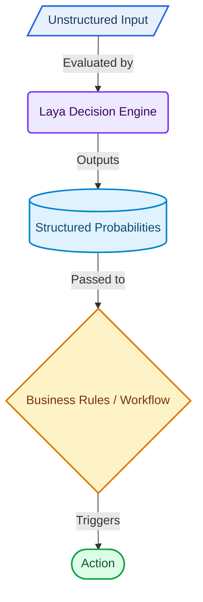

# Laya: Turning Unstructured Text into Structured Decisions

I recently started exploring **Laya**, an interesting AI decision engine that takes unstructured text and turns it into structured, probabilistic decisions.

Unlike a traditional LLM that generates text, Laya is designed to **answer typed decision questions directly**—making it useful for routing, classification, scoring, and automation workflows.

The Laya project describes itself as a *multilingual, non-autoregressive System 1 decision engine* that can evaluate multiple typed decisions in a single forward pass.

## Getting Started

There are several ways to get started with Laya:

**1. Using uv — recommended for this example**

```bash
uv add laya
```

Or create a virtual environment:

```bash
uv venv --python 3.12
uv pip install laya
```

**2. Using a standard Python virtual environment**

```bash
python -m venv .venv
source .venv/bin/activate
python -m pip install laya
```

**3. Running Laya as an HTTP server**

```bash
uv add "laya[serve]"
uv run laya-serve
```

The server is available at:

```text
http://localhost:8000
```

For the first example below, I'm using **uv**.

## Example 1 — Python

Suppose a customer says:

> "Help! My payouts have been failing for 3 days and I need a refund immediately."

We can define the decisions we want Laya to make:

```python
from laya import Router

router = Router(preload=True)

state = """
Help! My payouts have been failing for 3 days
and I need a refund immediately.
"""

questions = {
    "department": {
        "type": "choice",
        "instructions": "Route this ticket to the correct team.",
        "criteria": ["billing", "support", "sales"]
    },
    "urgency": {
        "type": "score",
        "instructions": "Rate customer urgency.",
        "criteria": [
            "Low urgency",
            "Medium urgency",
            "High urgency",
            "Critical urgency"
        ]
    },
    "refund_requested": {
        "type": "noul",
        "instructions": "Is the user asking for a refund?"
    }
}

result = router.predict(state, questions)
print(result)
```

The result can contain probabilities such as:

* **Department:** billing — 87.11%
* **Urgency:** probability distributed across four levels
* **Refund requested:** 73.73% yes

Instead of generating a paragraph of text, the application receives **structured decision data** that can be passed directly into business logic.

## Example 2 — HTTP API with cURL

Once `laya-serve` is running, the same type of decision can be accessed through HTTP:

```bash
curl -X POST http://localhost:8000/v1/systemone \
  -H "Content-Type: application/json" \
  -d '{
    "state": "Help! My payouts have been failing for 3 days.",
    "questions": {
      "is_urgent": {
        "type": "noul",
        "instructions": "Does this convey urgency?"
      }
    }
  }'
```

The API returns structured JSON containing the decision, probability, confidence, routing information, and usage details.

This makes Laya interesting not only for Python applications, but also for **microservices, existing applications, and language-independent systems** that can communicate over HTTP.

## Three Decision Types

Laya provides three useful decision primitives:

**Choice** — select among alternatives, such as `billing`, `support`, or `sales`.

**Score** — estimate a position on an ordered scale, such as low → critical urgency.

**Noul** — a binary-style decision that returns the probability of a positive/yes answer.

The overall architecture is simple:



One thing I noticed during testing is that Laya also reports confidence and calibration information. The checkpoint I tested produced a calibration warning, so I would **validate these probabilities against your own production data before using them as hard business thresholds**.

What I find interesting about Laya is the architectural possibility: **use a specialized decision model for fast, structured decisions and reserve generative LLMs for tasks that actually require generation.**

### References

* Laya GitHub: https://github.com/NandhaKishorM/laya
* Laya Quickstart — Route Mode: https://github.com/NandhaKishorM/laya#quickstart-route-mode-recommended
* uv Installation Guide: https://docs.astral.sh/uv/getting-started/installation/

#AI #MachineLearning #Laya #Python #uv #AIEngineering #Automation #LLM #TamilTechNetwork #TamilAI #Tamil #Ranch #TuitPro
